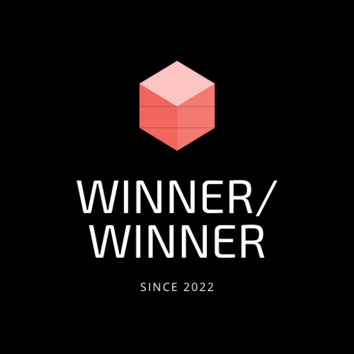
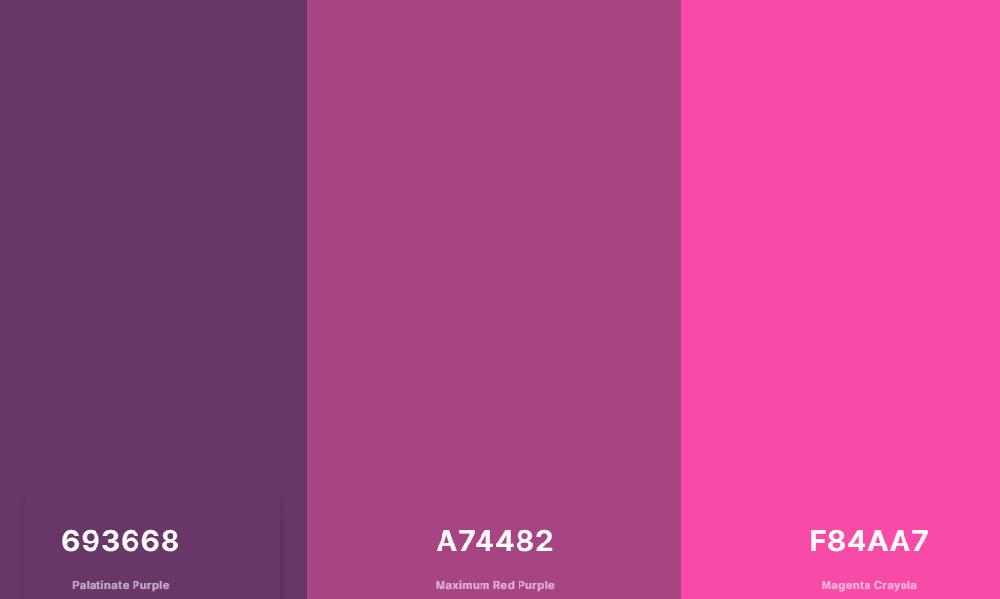
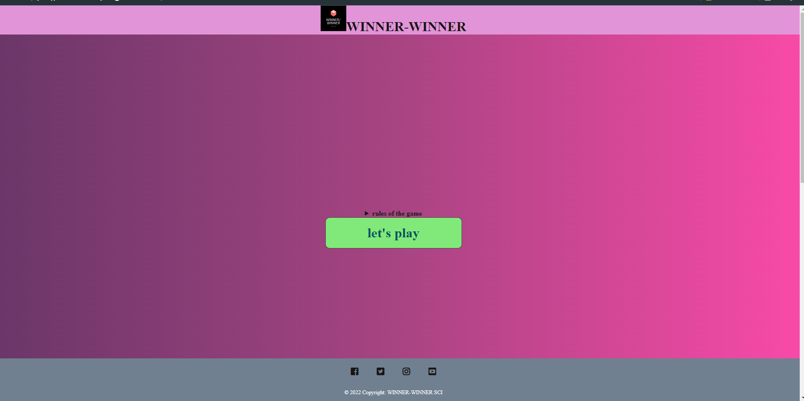
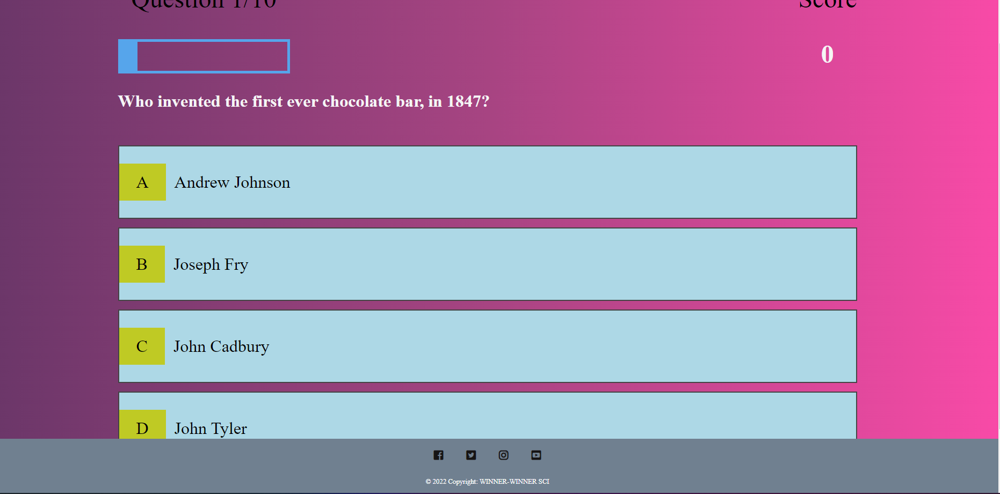
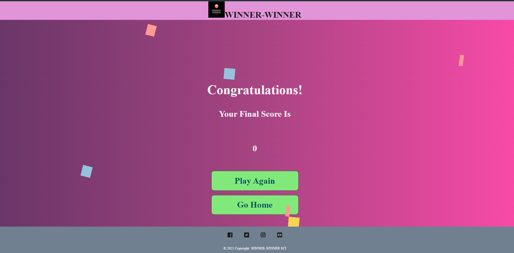

---
---

## Table of Contents
1. [General Info](#general-info)
2. [Project Specs](#general-info)
3. [Screenshots](#screenshots)
4. [Technologies](#technologies)
5. [Installation](#installation)
6. [Validation](#validation)
7. [FAQs](#faqs)
---
### General Info
***
WINNER-WINNER is an online multiple choice game created using the openTrivia API.
It was created as an ducational project to demostrate lessons learnt about Advanced JavaScript 

### 2ND MILESTONE PROJECT FOR CODE INSTITUTE – AN USER-CENTRIC INTERACTIVE WEBSITE

[VIEW THE LIVE PROJECT HERE](https://samironta.github.io/CI_MSP1_TOPNOTCH-HOTEL/)

---

### Project Specs

---

#### USER STORIES
1. As a first time user, I want game instructions
2. As a first time user, I want an intuitive interface
3. As a first time user, 
4. As a first time user, 

#### Site Owner 
13. As the site owner, I want users to find it easy to use my site
14. As the site owner, I want a beautiful looking site
15. As the site owner, users should be able to customise their experience

---
### Color Palette

Color Palette

---

### Screenshots

Welcome Screen

Quiz Page

Game Over Screen

---
## Technologies
***
### Languages
- HTML
- CSS
- JavaScript

### Frameworks & Tools

- Git
- GitHub
- Gitpod
- Figma
- Google Fonts
- Font Awsome
- coolors.co
- Favicon.io
---
## Installation
***
The website was deployed using GitHub Pages by following these steps:
1. In the GitHub repository navigate to the Settings tab
2. On the left hand menu select Pages
3. For the source select Branch: master
4. After the webpage refreshes automaticaly you will se a ribbon on the top saying: "Your site is published at https:/"

You can for fork the repository by following these steps:
1. Go to the GitHub repository
2. Click on Fork button in upper right hand corner

You can clone the repository by following these steps:
1. Go to the GitHub repository 
2. Locate the Code button above the list of files and click it 
3. Select if you prefere to clone using HTTPS, SSH, or Github CLI and click the copy button to copy the URL to your clipboard
4. Open Git Bash
5. Change the current working directory to the one where you want the cloned directory
6. Type git clone and paste the URL from the clipboard ($ git clone https://github.com/YOUR-USERNAME/YOUR-REPOSITORY)
7.Press Enter to create your local clone.

---

## Validation

### HTML Validation
The W3C Markup Validation Service was used to validate the HTML of the website. All pages pass with no errors no warnings to show.

Home

About

Menu

Gallery

Home

### CSS Validation
The W3C Jigsaw CSS Validation Service was used to validate the CSS of the website.
When validating the page as a whole, the validator shows some errors linked to Bootstrap v5.0. When validating just my own custom CSS it passes with no errors found and some warnings associated to using root variables.

whole page

style.css

### Accessibility
The WAVE WebAIM web accessibility evaluation tool was used to ensure the website met high accessibility standards. All pages pass with 0 errors.

Home

About

Menu

Gallery

Contact

---
## Collaboration
***
Give instructions on how to collaborate with your project.
> Maybe you want to write a quote in this part. 
> Should it encompass several lines?
> This is how you do it.
## FAQs
***
***
Give instructions on how to collaborate with your project.
> Maybe you want to write a quote in this part. 
> Should it encompass several lines?
> This is how you do it.
## FAQs
***
A list of frequently asked questions
1. **This is a question in bold**
Answer to the first question with _italic words_. 
2. __Second question in bold__ 
To answer this question, we use an unordered list:
* First point
* Second Point
* Third point
3. **Third question in bold**
Answer to the third question with *italic words*.
4. **Fourth question in bold**
| Headline 1 in the tablehead | Headline 2 in the tablehead | Headline 3 in the tablehead |
|:--------------|:-------------:|--------------:|
| text-align left | text-align center | text-align right |

